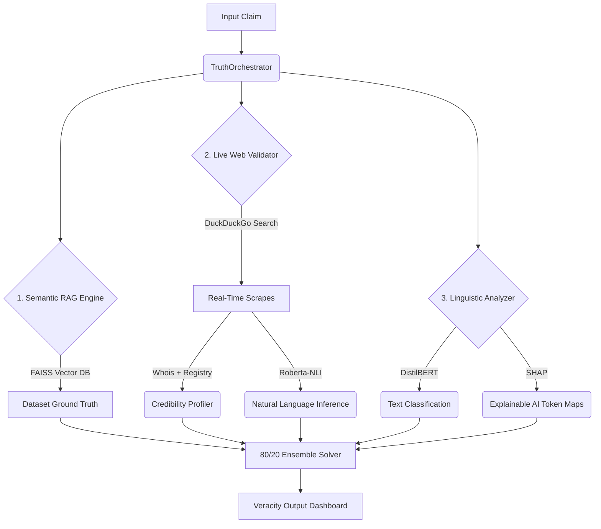

# 🔍 TruthLens Pro: Next-Gen Hybrid Fact-Checking Engine

TruthLens Pro is a premium, state-of-the-art hybrid fact-checking dashboard that mitigates misinformation by combining local historical knowledge bases with real-time web verification and linguistic explainable AI (XAI). Built using Streamlit, Python, and advanced NLP transformers, TruthLens Pro delivers instant, weighted, and explainable veracity verdicts.

---

## ✨ Features & Architecture

TruthLens Pro runs a **Multi-Engine Mathematical Ensemble** (typically weighted 80% Web/RAG + 20% Linguistic) to evaluate any text claim:



### 1. 🗄️ Semantic RAG Engine (`core/rag_engine.py`)
Matches input claims semantically against historical dataset records (like the LIAR dataset) using **FAISS** vector indexing and `all-MiniLM-L6-v2` embeddings. 
- Fast $O(\log N)$ semantic retrieval.
- Prevents redundant checking of previously debunked viral rumors.
- Provides immediate ground-truth matching.

### 2. 🌐 Live Web Validator & Credibility Profiler (`core/web_validator.py` & `core/credibility.py`)
Compiles real-time evidence directly from the web using DuckDuckGo APIs.
- **Query Planner:** Breaks complex claims down into atomic keyword searches using NLTK RAKE and spaCy NLP.
- **Natural Language Inference (NLI):** Uses `cross-encoder/nli-distilroberta-base` to determine whether web evidence *Entails*, *Contradicts*, or is *Neutral* to the claim.
- **Credibility Profiler:** Weights each source's reliability dynamically using WHOIS domain age registration data, custom blacklists/whitelists, and domain authority mappings.
- **NLP Heuristics:** Includes override safeguards for death/life events, temporal (year) mismatches, and quantitative discrepancy checks.

### 3. 🧠 Linguistic Analyzer & Explainable AI (`core/linguistics.py`)
Analyzes the stylistic tone and syntax structure of the claim to detect deception cues (bias, sensationalism, clickbait structure).
- Uses a local fine-tuned **DistilBERT** model (or falls back to `jy46604790/Fake-News-Bert-Detect`).
- **SHAP (SHapley Additive exPlanations):** Computes token-level mathematical contributions to explain *why* the model made a decision, rendering them as interactive highlight pills.

---

## 📁 Repository Structure

We've organized the project for maximum modularity and cleanliness:

```bash
TruthLens_Pro/
├── .streamlit/               # Streamlit styling configuration
├── core/                     # Backend Logic & Core Engines
│   ├── credibility.py        # Domain assessment & registry check
│   ├── linguistics.py        # Deception detection & SHAP XAI
│   ├── llm_judge.py          # LLM Orchestrator
│   ├── orchestrator.py       # Main ensemble coordinator
│   ├── query_planner.py      # Claim parsing & search term planner
│   ├── rag_engine.py         # FAISS vector database interface
│   └── web_validator.py      # DuckDuckGo search + NLI scraper
├── data/                     # Data stores and indexes
├── scripts/                  # Command line diagnostic utilities
│   ├── debug_claim.py        # Runs diagnostics on a test claim
│   ├── debug_orch.py         # Core orchestrator tester
│   ├── debug_web.py          # Tests the live web scraper & profiler
│   ├── trace_true_claim.py   # Step-by-step query tracing
│   └── train_model.py        # Local DistilBERT model training script
├── tests/                    # Robust unit & integration tests
│   ├── test_accuracy.py      # System evaluation metrics (F1-score)
│   ├── test_bert.py          # BERT classifier validator
│   ├── test_bias.py          # Bias detection checks
│   └── ...                   # Other modular tests
├── app.py                    # Streamlit minimalist UI entry point
├── run_app.bat               # Fast launch script for Windows
├── requirements.txt          # Python dependencies
└── README.md                 # Project documentation
```

---

## 🚀 Installation & Local Launch

Ensure you have Python 3.10+ installed.

1. **Clone the repository:**
   ```bash
   git clone <your-repository-url>
   cd TruthLens_Pro
   ```

2. **Install dependencies:**
   ```bash
   pip install -r requirements.txt
   python -m spacy download en_core_web_sm
   ```

3. **Run the Streamlit Dashboard:**
   ```bash
   streamlit run app.py
   ```

4. *(Optional)* **Train your custom local Linguistic model:**
   If you want to train your own deception classification model on the LIAR dataset instead of using the fallback model, execute:
   ```bash
   python scripts/train_model.py
   ```

---

## ☁️ Deploying to Streamlit Community Cloud

TruthLens Pro is fully prepped for direct cloud deployment:

1. Push this project to your GitHub repository.
2. Go to [share.streamlit.io](https://share.streamlit.io/) and log in with your GitHub account.
3. Click **New App**, select your repository, branch, and specify `app.py` as the entry file.
4. Streamlit Cloud will automatically detect `requirements.txt` and install all required modules.

> [!TIP]
> Make sure to add any required API keys (e.g., if you hook up custom LLM judges or advanced search proxies) in the Streamlit **Secrets** configuration panel on the dashboard.

---

## 🛡️ License
Distributed under the MIT License. See `LICENSE` for more information.
