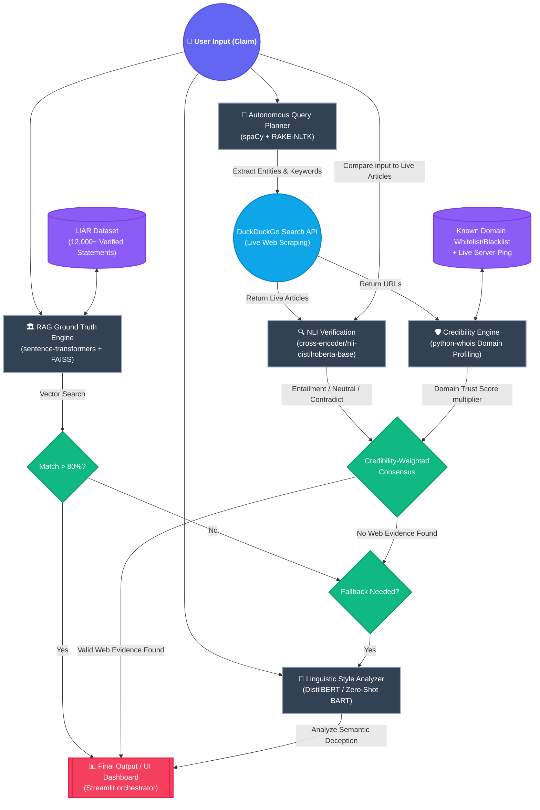

# TruthLens Pro: System Architecture Block Diagram

Below is the Mermaid-js block diagram detailing the hybrid pipeline of the TruthLens Pro fact-checking system. 

If your markdown viewer supports Mermaid (like GitHub, GitLab, or VS Code), it will render automatically. You can also copy the code block below and paste it into [Mermaid Live Editor](https://mermaid.live/) to generate a high-quality PNG or SVG image.

